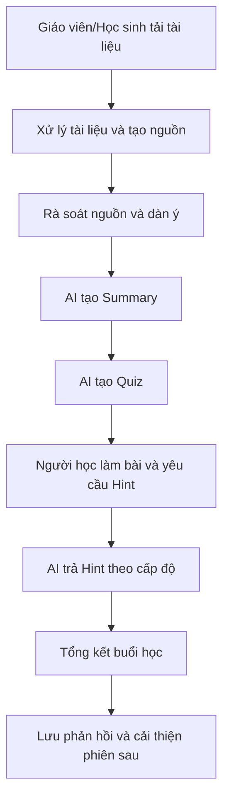

# Reflection - Hackathon Day 06

## 1. Thông tin cá nhân
- **Họ và tên:** Nông Trung Kiên
- **Mã học viên:** 2A202600414

## 2. Role trong dự án
Trong dự án hackathon này, em đảm nhiệm vai trò kết nối giữa phần đặc tả sản phẩm và triển khai kỹ thuật thực tế, tập trung vào:
- Chuẩn hóa tài liệu yêu cầu và kiến trúc để cả nhóm có cùng định hướng.
- Đóng góp vào backend logic cho các luồng dữ liệu quan trọng.
- Cải thiện trải nghiệm frontend ở các tính năng học tập có AI.
- Điều phối tích hợp mã nguồn thông qua merge branch và xử lý conflict.

## 3. Đóng góp chính

### 3.1. Thiết kế tài liệu nền tảng
- Thiết kế và hoàn thiện các tài liệu: **PRD, SRS, TECHSTACK**.
- Đóng vai trò làm rõ phạm vi tính năng, luồng người dùng, yêu cầu phi chức năng và định hướng stack cho team.

### 3.2. Cải thiện backend logic upload tài liệu
- Sửa backend logic ở chức năng tải tài liệu lên.
- Mục tiêu là giúp luồng upload ổn định hơn, tạo nền tảng tốt cho các bước xử lý/tóm tắt/quiz phía sau.

### 3.3. Cải thiện giao diện xem tài liệu nhiều định dạng
- Sửa giao diện view các tài liệu định dạng khác nhau như **DOC, TXT, slide**.
- Giúp trải nghiệm đọc tài liệu của học sinh/giao viên thống nhất hơn giữa các loại file.

### 3.4. Mở rộng chức năng Summary (FE + BE)
- Thêm chức năng lưu trữ kết quả **tóm tắt (summary)** từ model AI trả về ở backend.
- Ở frontend, thêm nút **reload** để gọi một bản tóm tắt khác.
- Thêm tương tác **like/dislike** để người dùng phản hồi chất lượng summary.

### 3.5. Mở rộng chức năng Quiz (FE + BE)
- Thêm chức năng lưu trữ kết quả **quiz** từ model AI trả về ở backend.
- Ở frontend, thêm nút **reload** để tạo lại một bộ kiểm tra khác từ cùng tài liệu/ngữ cảnh.

### 3.6. Tích hợp mã nguồn
- Thực hiện merge branch và xử lý conflict mã nguồn.
- Đảm bảo các phần đóng góp của thành viên được tích hợp đồng bộ, giảm rủi ro vỡ luồng chức năng.

### 3.7. Thiết kế Prototype Workflow
- Em tham gia thiết kế và chuẩn hóa luồng prototype tương tác cho AI Learning Co-pilot theo mô hình từng bước rõ ràng.
- Workflow được xây dựng theo 6 bước xuyên suốt một phiên học:
  1. **Tải tài liệu** (nhận và xử lý nguồn học tập)
  2. **Rà soát nguồn** (kiểm tra dàn ý/chất lượng nội dung)
  3. **Tóm tắt** (sinh key points từ tài liệu)
  4. **Quiz** (tạo bộ câu hỏi tự kiểm tra)
  5. **Gợi ý** (hỗ trợ theo cấp độ khi người học bí)
  6. **Phản hồi** (tổng kết kết quả học và lưu phản hồi)
- Việc tách luồng theo step giúp dễ demo, dễ test, đồng thời bám sát hành trình học thật của học sinh từ tiếp nhận tài liệu đến đánh giá kết quả.

### 3.8. Workflow Diagram của dự án hackathon
Em thể hiện workflow dưới dạng sơ đồ để đồng bộ giữa tài liệu nghiệp vụ và triển khai kỹ thuật:

Sơ đồ này giúp team thống nhất:
- Điểm bắt đầu và điểm kết thúc của một phiên học.
- Thứ tự các module FE/BE và AI service cần phối hợp.
- Các điểm có thể đo lường chất lượng (summary, quiz, hint, feedback) để cải tiến liên tục.

## 4. Reflection cá nhân
Qua dự án này, em rút ra một số điểm quan trọng:
- **Tài liệu tốt giúp code nhanh hơn:** Việc đầu tư PRD/SRS/TECHSTACK ngay từ đầu giúp giảm tranh luận mơ hồ và giúp team triển khai thống nhất hơn.
- **Tính ổn định của backend là nền tảng:** Các luồng AI (summary/quiz) chỉ vận hành tốt khi dữ liệu đầu vào (upload, lưu trữ, truy xuất) được xử lý chắc chắn.
- **UX ảnh hưởng trực tiếp đến giá trị AI:** Các nút reload, like/dislike tuy nhỏ nhưng giúp người học tương tác chủ động hơn và tăng giá trị sử dụng thực tế.
- **Merge conflict là kỹ năng bắt buộc trong teamwork:** Không chỉ là thao tác git, mà còn là quá trình hiểu logic của nhiều phần code để giữ hệ thống nhất quán.

## 5. Hướng cải thiện của bản thân
- Chủ động chuẩn hóa convention code và naming sớm hơn để giảm conflict khi merge.
- Bổ sung thêm test cho các luồng upload, summary, quiz để hạn chế regression.
- Theo dõi chất lượng phản hồi AI dựa trên tín hiệu người dùng (like/dislike) để tinh chỉnh prompt và pipeline tốt hơn.

